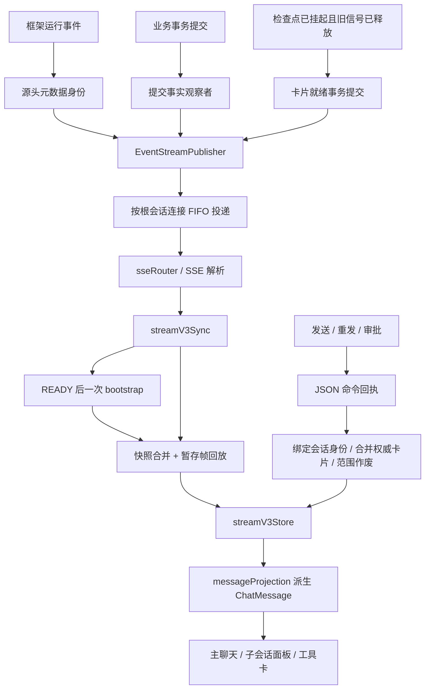

# 流式渲染交付复核

日期：2026-10-05。范围：当前工作区前后端实现、默认回归、构建与新增交付反例。

**判定：主链路已迁移到 v3，上轮切会话缺陷已修复；完整交付仍未完成。**

本轮只审查，新增可执行反例；未修改生产实现，未提交代码。工作区已有大量其他修改，结论针对本次读取、运行时的工作区，不代表已发布版本。

## 1. 实测证据

| 检查 | 本轮结果 | 证明范围 |
|---|---|---|
| 前端默认 `npm test` | 136 + 4 条通过 | 已纳入默认入口的单元、集成和 Node 操作测试 |
| `npm run build` | vue-tsc、Vite 通过 | 类型与生产打包 |
| 后端 `mvn -o test` | 484 条通过，0 失败、错误、跳过 | 现有后端回归 |
| 新增 `streamV3DeliveryAudit.test.ts` | **8 条：1 通过、7 失败** | 本报告新增的真实 SSE 同步与生产组合函数边界 |

新增反例尚未加入默认 `npm test`，因此“默认门禁全绿”和“交付反例失败”同时成立。不得把默认通过数当作全部需求完成的证据。

复现命令，在 `D:\Code\LingXi\frontend` 执行：

```powershell
npx.cmd tsx --test tests/streamV3DeliveryAudit.test.ts
```

测试使用真实 `sseRouter → readSseResponse → streamV3Sync → streamV3Store → messageProjection`；涉及界面职责时调用真实 `useChatView`。网络出口由 harness 控制，推帧后显式 `flush()`，断言在测试主体执行，不依赖 sleep，也不把断言藏在生产 try/catch 内的替身里。

这些测试没有挂载 Vue 组件，没有真实后端 HTTP/SSE，也没有 Electron 窗口。因此不证明 DOM 点击、依赖注入、卸载生命周期或真实部署环境全部正确。

## 2. 当前实际流程



### 2.1 发送与连接

已有会话通常先订阅根连接，再发送命令。发送、重发、审批走 JSON 回执，正文不再依赖请求级 SSE。新会话受理后取得真实会话身份，再挂根连接。

连接选择由当前查看的根会话决定。A 的迟到命令回执只更新 A 的事实，不得摘掉当前 B 的连接。切走时退订、关旧连接并作废在途同步 token；切回重新同步持久化状态和未决卡片。

根、子事件都应进入同一根连接，实体归属仍使用事件自身的 `sessionId / turnId / executionId`。这是“投递目的地”和“实体属于谁”的区别。

### 2.2 文本与思考

响应开始时生成 `streamKey`。正文、思考增量进入该响应槽；新轮次即使还没有 AI 落库行，也能派生稳定的回答气泡。`RESPONSE_FINALIZED` 定稿，`MESSAGE_COMMITTED` 绑定持久化消息身份。USER 行不要求 streamKey。

同执行挂起、恢复时，新 streamKey 表示新响应片段；派生层把它追加到同一轮回答组，保留已提交片段。暂停定格原响应，后续正常增量不能继续改写它。

### 2.3 卡片

后端 `LocalExecutionRepository.unregister` 先释放 active 信号，再在提交边界通知挂起监听器。`ToolCallReadinessService` 再核验 SUSPENDED、非 active，提交就绪状态，提交后发送完整卡片 DTO。

因此最初“卡片先开放，执行还没暂停”的根因已有正确的后端门闩。卡片只凭 `TOOL_CALL_UPDATED` 可以显示，无宿主卡片派生独立稳定气泡，审批权限来自 DTO，而不是前端猜测。

但**卡片初次开放正确，不代表决断后的所有客户端都能正确收口**；见第 4 节。

### 2.4 同步和历史

`streamV3Sync` 负责 READY、连接身份和同步 token；store 在 bootstrap 在途期间有条数、字节数受限的暂存区。快照返回后按 FIFO 回放。

详情、分页、终态对账已改为同代际合并；子会话写自己的历史槽，代际校验归根。这些迁移方向正确。问题集中在“哪些暂存事实已经被快照覆盖”“同步失败之后谁负责恢复”“范围作废是否被整体清空覆盖”。

## 3. 已确认完成的部分

| 能力 | 本轮结论 |
|---|---|
| 新轮次只有 USER 行时即时显示 AI 增量 | 上轮缺陷已修，回归通过 |
| 正常 A→B→A 后继续收 SSE | 回归通过 |
| A 命令回执迟到不关闭 B 连接 | 上轮缺陷已修，回归通过 |
| 真正断流重连后重新 bootstrap | 上轮缺陷已修，回归通过 |
| 旧 bootstrap 迟到不覆盖新同步代次 | 已有回归通过 |
| 同一连接重复 READY 保持 live，后续增量直接应用 | 本轮新增反例通过 |
| 普通切走、决断、切回时清掉旧 pending 卡 | 上轮缺陷已修，回归通过 |
| 无宿主卡即时显示、同 id 更新不增殖 | 回归通过 |
| 同执行挂起、恢复保留已有正文 | 已有回归通过 |
| 重发迟到回执不抹掉已到达的新正文 | 已有回归通过 |
| 删除兼容消息表和三张子会话重复表 | 主消息视图已由 v3 派生 |

因此不能把本轮问题概括为“之前的迁移没做”。已有实现解决了大量问题，剩余缺陷在同步与最终状态收敛的交界处。

## 4. 阻止完整交付的可执行问题

### D1：新快照被同代际作废事件清空（P0）

位置：`frontend/src/stores/streamV3Store.ts`，`applyBootstrap`、`applyHistoryInvalidated`。

时序：连接已经订阅 → bootstrap 在途 → `HISTORY_INVALIDATED(rev=2)` 暂存 → bootstrap 返回 rev=2 的正确历史 → 回放这条失效事件。

结果：`applyHistoryInvalidated` 不比较当前 revision，直接再次 `invalidateGeneration`。刚装入的 rev=2 历史被清掉，连接却停在 live，没有再同步。

这不是需要服务端重复投递才会出现的时序。失效事务发生在 bootstrap 查询之前，而通知在查询往返期间暂存即可触发。

验收：相同 revision 幂等；更旧 revision 不回退；只有更高 revision 才执行其作废语义。检查暂存 delta/提交是否属于已作废代际，不能只依赖“这个 streamKey 曾出现过”的墓碑。

### D2：重发清掉目标轮次之前的有效历史（P1）

位置：`applyHistoryInvalidated → invalidateGeneration`；后端 `StreamV3Payloads.HistoryInvalidated`、`CommittedStateV3Observer.publishHistoryInvalidated`。

复现：历史有第一轮和第二轮，重发第二轮。失效帧先到，JSON 回执随后按 `t2` 范围作废。

结果：失效帧先清了**整个根历史槽**，第一轮也消失。范围化回执只负责删目标范围，不能把第一轮恢复。之前的重发回归多以第一轮为目标，没覆盖有效前缀。

后端回滚已经算出了 `invalidatedTurnIds / invalidatedExecutionIds`，提交事实也携带这些集合；v3 的失效 payload 却只包含 rootSessionId 和 revision，把范围丢掉了。

验收：范围随提交事实直投，不再查库。帧与回执使用同一个范围化作废逻辑，两个到达顺序都保留有效前缀；其他根会话、未作废子会话不能被误删。

### D3：已审批卡片被暂存 pending 帧复活（P1）

位置：`applyBootstrap`、`reconcilePendingTools`、`applyToolCallUpdated`、`messageProjection` 卡片重挂。

时序：pending v1 事件暂存 → 另一客户端完成审批 → bootstrap 的未决集合为空，历史 TOOL 行带已决断 v2 → 回放 pending v1。

结果：历史的已决断 ToolCallVO 没有进入 `tools` 的版本比较基线。v1 在 tools 槽里被当作新实体接纳；派生层把历史 v2 卡片摘掉，再挂 v1，于是审批按钮重新出现。

本轮真实 SSE 用例直接断言派生卡片仍 pending，失败。因此“普通切回清旧卡”已经修复，但“同步屏障里的旧卡事件”仍会空悬挂。

验收：bootstrap 历史中携带的完整工具事实同样进入权威版本合并；版本较旧的暂存卡不能覆盖较新的已决断事实。保留范围语义，不把分页之外的缺失实体一概推断为已删除。

### D4：bootstrap 失败和暂存溢出没有完整恢复路径（P1，两条反例）

位置：`frontend/src/services/streamV3Sync.ts:runBootstrap`；store 的 `abortSync`、`stage`。

bootstrap 失败只把 phase 设为 idle、清暂存。协调器没有登记重试、重连或用户可见的同步失败入口，SSE 仍然开着。真实发布器只在建连时发一次 READY，“同连接再收到 READY 可以重试”不能代替实际恢复机制。普通未来事件仍可应用，但此前缺失的历史、卡片没有自愈保证。

溢出又更进一步：stage 清缓冲、设 idle，**没有作废同步 token**；旧 bootstrap 返回仍被接纳，最后设为 live。暂存的正文已经丢失，系统却声称同步成功。

源码写了“上层观察 idle 后退避重连”，本轮搜索未找到该观察者。

验收：统一同步失败出口，作废 token，终止旧同步，登记有界退避恢复。同步失败才触发一次补偿，不轮询数据库，不加后端事件缓存。旧响应不能把失败状态改成成功。

### D5：界面运行态仍读旧会话对象（P1）

位置：`frontend/src/views/chat/useChatView.ts:721`、`frontend/src/utils/sessionRunState.ts`。

实时 `SESSION_UPDATED(runStatus=RUNNING)` 已进入 `streamV3Store.sessions`，但 `isSending` 仍读取 `currentActiveSession.runStatus` 和本地命令计数。该会话对象来自 localSessions/props，未随这条 v3 更新。

新增生产组合函数用例：store 为 RUNNING，view.isSending 为 false。命令 JSON 回执结束后，本地计数又减为零，发送守卫和关联按钮可能提前退出运行态。相反，旧快照一直 RUNNING 时也可能迟迟不能收口。

验收：查看会话的业务运行态从 v3 权威实体/执行派生；本地计数只代表尚未受理的请求，并按发起会话隔离。不要重新建立一张兼容运行态表。

### D6：终态对账只触发第一次（P1）

位置：`frontend/src/views/chat/useChatView.ts:802` 起的 watch。

watch 监听的是“整个 executions Map 是否存在任何终态”，返回 rootId 或空串。第一个执行结束后，这个条件长期为 true；第二个执行 RUNNING→COMPLETED，返回值始终还是同一个 rootId，第二次对账不触发。

本轮生产入口用例期望树对账两次，实际一次。另外 Map 未按当前根会话筛选，别的根会话的终态也可参与判断。

验收：按归属根会话及 executionId 跟踪一次生命周期收尾。挂起/恢复如需分别收口，定义该边界的身份；不每个 token 重跑对账，也不扫描整个 Map 后用“存在任意终态”的布尔量代替事件身份。

## 5. 后端生产覆盖与静态确认的额外缺口

以下是本轮调用链审查发现，不混入上述 7 条失败的统计；真实多客户端和真实工具执行尚未另起端到端用例。

### 5.1 卡片更新只覆盖 ready，决断完成缺 v3 广播

`ToolCallReadinessService` 发完整 `TOOL_CALL_UPDATED`。但 `VersionedToolCallDecisionService.notifyPending` 发的是旧 `ToolCallPendingEvent`；`ToolCallStreamAdapter` 走 v2 `StreamEntityPublisher`；`CommittedStateV3Observer` 对 TOOL 提交直接跳过。

当前已知 v3 发布器注入方中，没有覆盖 TOOL 任意提交后版本更新的生产者。因此审批客户端依靠 JSON 回执 `ingestToolCall` 可以更新自己，但别的 v3 客户端不能靠这个回执收口；普通工具完成、委派结论也要分别核对生产覆盖。

这与 D3 有联系，但不是同一个缺陷：前者是版本基线错误，后者是最新事实没有上实时通道。

建议 TOOL 提交事实携带已提交完整 DTO 和根身份，由提交后的统一出口直投 v3。不能把“只在 ready 时发一次”写成“工具全生命周期已迁移”。

### 5.2 普通工具结果不在 MESSAGE_COMMITTED 载荷里

`TranscriptRecordAssembler` 的 TOOL 行 text 存工具 id；`CommittedStateV3Observer.resolveContent` 却对它按 Message JSON 解析，失败后置空。MessageCommitted DTO 没有 toolCallId、toolCall 字段，前端也不补这两个字段。

AI 提交带的 toolCalls 是请求名、参数，不能等同于工具执行结果。历史分页能组装完整 TOOL 事实，不代表实时提交能显示结果。加上 5.1 的发布缺口，正常工具结果可能只能等后续对账/刷新。

应复用已提交的工具事实，不在观察者里逐工具 GET。

### 5.3 上下文用量尚未成为实时指标

`setContextUsage` 没有生产写入方，目前只从 tree/detail 种入。`AgentEventListener.onContextUpdate` 会进入默认 v3 映射，变成 `EXECUTION_UPDATED(state=事件名)`，上下文载荷本身丢失；前端会把这个事件名写进 execution.status。

因此既缺实时用量更新，又混入了非执行状态。生产端应显式列举生命周期事件；其他事件要有明确的协议处理或明确跳过，不能全部塞进执行状态。

### 5.4 旧 v2 观察者仍带来后台查询与投影初始化

TEXT/THINKING 的 v3 热路径没有身份查询，符合核心目标。但 `ToolCallStreamAdapter` 在 TOOL/EXECUTION 提交时仍查询工具、轮次，再经 `StreamEntityPublisher` 查询根身份；`SessionStreamHub.publish` 还可能初始化旧投影。

这些观察者是提交订阅者，并非“只有 v2 浏览器订阅才执行”。所以不能把“v3 发布器零查询”扩大为“整个提交通知链零查询、旧投影完全退役”。旧客户端兼容若继续保留，应明确其成本与退出条件；纯 v3 根会话不应顺带维护无人消费的旧投影。

## 6. 成本与设计判断

主方向仍合理，没有必要重新造事件库、全局 seq 或后端缓存。

- v3 增量：源头身份 → 构造轻量 DTO → 无订阅直接跳过；有订阅时序列化一次，按连接入队。没有每 token 查库。
- 连接 FIFO 队列是网络背压队列，用来防慢客户端阻塞发布方；不是“卡片先派发、再等队列补就绪状态”的业务队列。它的作用可以保留。
- bootstrap 是建连/重连时补持久化状态；目前还存在 detail 和终态分页对账，所以实际请求数不能描述成“整个会话只查询一次”。终态对账上限 10 页，每页 100 条，应按明确收尾身份触发。
- 前端 delta 会复制响应 Map，派生层虽复用基础聚合，也会遍历活响应、创建展示数组。不能声称所有工作 O(1)，但当前无需用新缓存掩盖一致性问题。
- `baseCache` 和墓碑保留的容量边界仍是长期治理项，不是本轮主要阻塞。
- eventId 是发布身份，不是可恢复的数据库日志游标。当前系统没有逐事件持久化与完整断点回放承诺。

**切走期间尚未落库的 token 不会由 bootstrap 重建。** 切回后可以继续接收未来片段，已提交历史、未决卡片可恢复；切走期间的未提交片段要等最终完整定稿/落库才补齐。这是当前无回放设计的能力边界。若交付要求“切回立刻恢复完整正在生成的正文”，当前架构不满足，应单独确定需求，不能默默当作已实现。

## 7. 最小收尾计划

1. **先修失效语义。** 透传已知作废范围，revision 单调且同值幂等，保留有效前缀；不要用根历史整体清空代替范围作废。让 D1/D2 转绿。
2. **再补卡片最终事实。** 历史 TOOL 事实进入版本基线；TOOL 提交后的完成/决断 v3 广播有生产者。让 D3 转绿，补双客户端审批和普通工具结果用例。
3. **闭合同步失败出口。** 失败、溢出都作废旧 token，并明确退避恢复与可见状态。让 D4 两条用例转绿。
4. **统一界面运行态和收尾身份。** v3 决定业务状态，本地状态只表示请求在途；按根/执行收尾一次。让 D5/D6 转绿。
5. 把新增审查用例纳入默认门禁；补挂载组件的审批点击、失败横幅、切换会话与按钮状态验证，再更新交付报告。审查遗留导出测试是否调用生产构造函数，不能只复刻同样实现；重发参数桩捕获也不等于验证了真实 HTTP 端点。

每一步都有明确反例，不需要扩大成新一轮架构重写，也不需要引入高频补查或后端缓存。

## 8. 交付状态

| 层面 | 状态 |
|---|---|
| v3 单根连接、源头身份、唯一消息状态、派生渲染主链 | 已落地 |
| 上轮 5 个切会话/新气泡/卡片普通切回缺陷 | 已修复并回归 |
| 快照与实时事件收敛、范围重发、异常恢复 | 尚有可执行失败 |
| 卡片决断后的多客户端最终状态 | 生产覆盖不完整 |
| 界面运行态、连续执行收尾 | 尚有可执行失败 |
| 真实 DOM / 部署端到端 | 尚未验证 |
| **完整交付** | **No-Go；完成上述收尾后再验收** |

产出：`frontend/tests/streamV3DeliveryAudit.test.ts`、本报告。原默认回归未改，旧报告未覆盖；应以本轮可执行反例更新“已完成”的表述。
